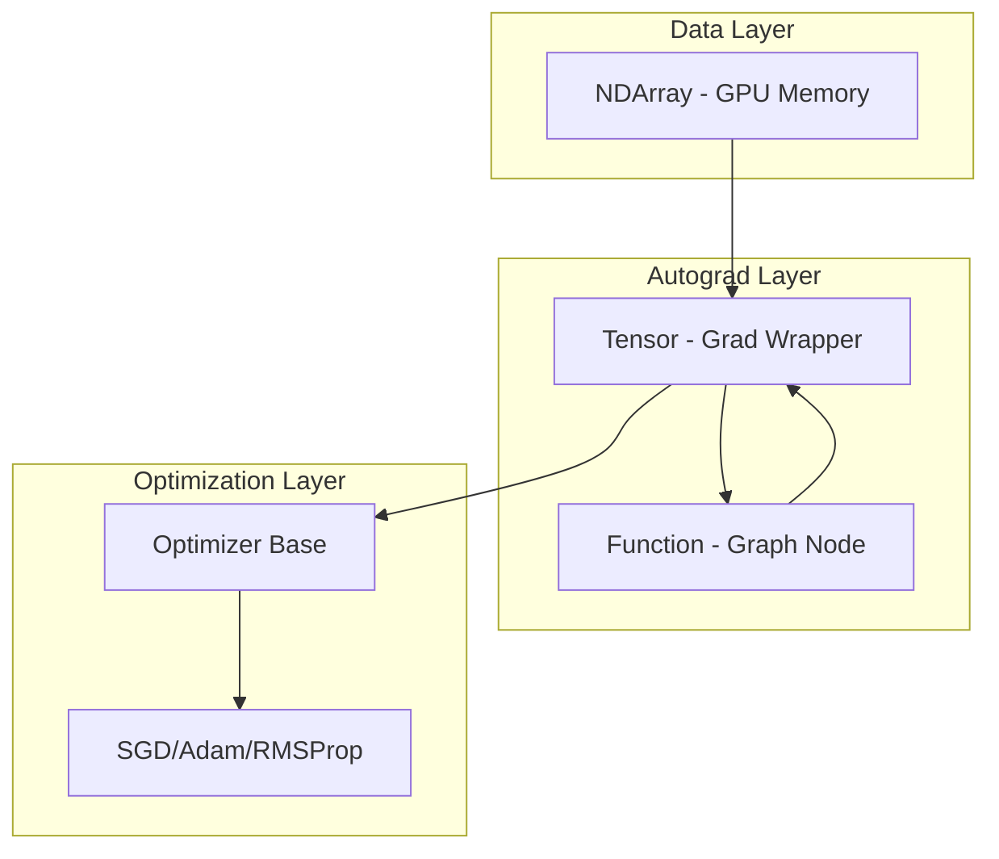
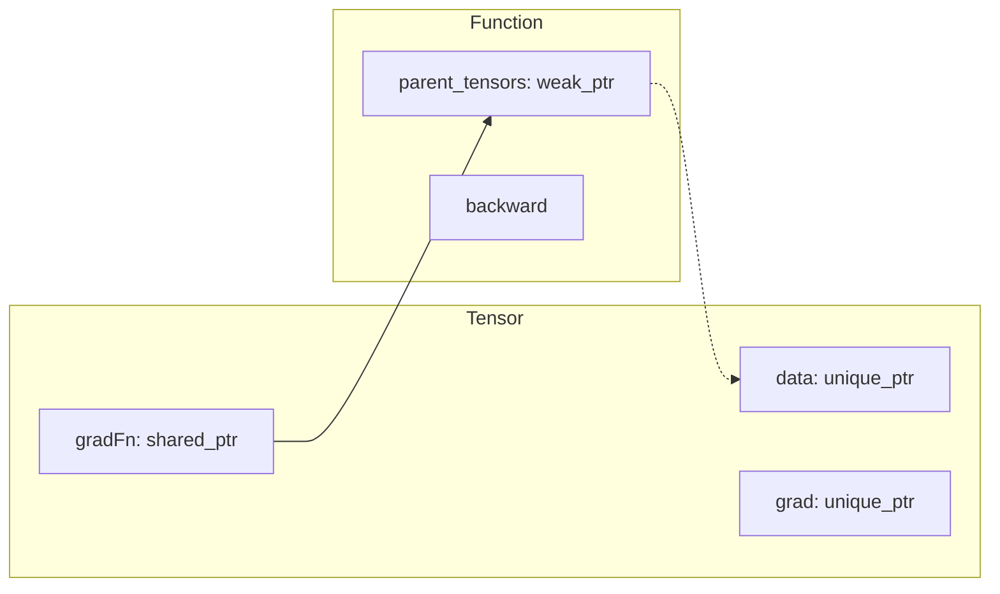
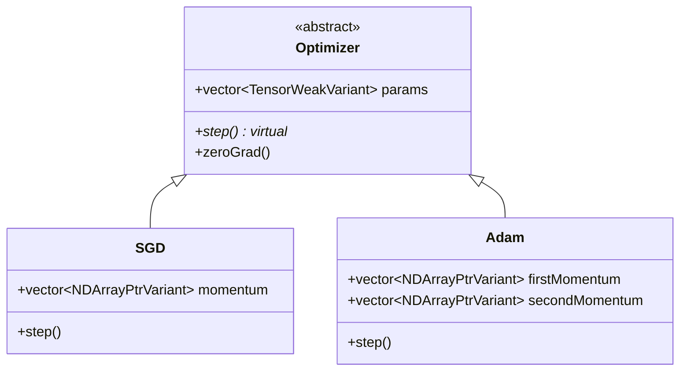
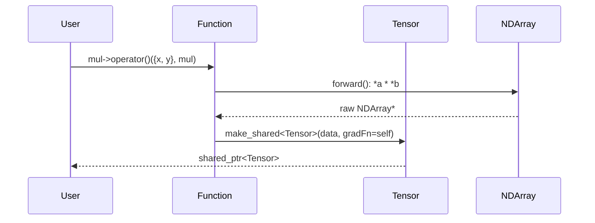
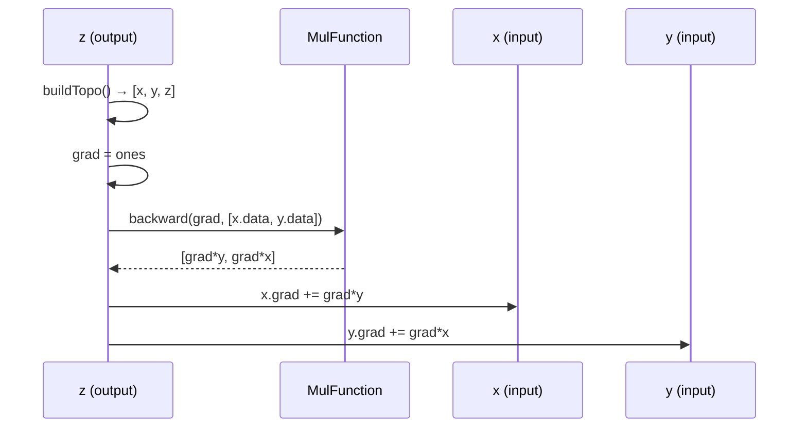
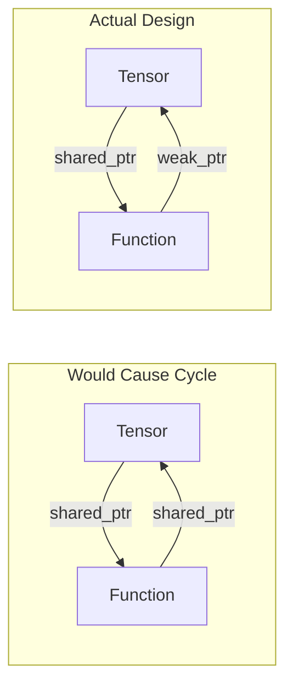

# ArrC Autograd/NDArray Framework Analysis Report

## Overview

ArrC is a CUDA-based deep learning framework implementing automatic differentiation with GPU-accelerated tensor operations. This report provides a comprehensive analysis of functionality, component integration, and memory management.

---

# Part 1: Framework Components and Integration

## 1. Core Components Architecture



---

## 2. NDArray Component

**File**: [ndarray.cuh](file:///d:/CUDA/Oak/ArrC/include/ndarray.cuh)

### Core Functionality

| Feature | Implementation | Status |
|---------|---------------|--------|
| GPU Memory Allocation | `cudaMallocManaged` | ✅ Working |
| Strided Views | `offset` + `strides` | ✅ Working |
| Broadcasting | `getBroadcastInfo()` | ✅ Working |
| Element-wise Ops | CUDA kernels | ✅ Working |
| Copy/Move Semantics | RAII pattern | ✅ Working |

### Key Implementation Details

**Memory Ownership Model**:
```cpp
// Line 37: ownsData flag distinguishes owners from views
int offset; bool ownsData;
```

**Allocator Constructor** (lines 134-154):
- Allocates GPU memory via `cudaMallocManaged`
- Sets `ownsData = true`
- Tracks allocation in static `totalAllocatedMemory`

**View Constructor** (lines 166-181):
- Takes existing data pointer
- Sets `ownsData = false`
- Allows slicing without copying

**Element-wise Operations** (lines 318-419):
- Two CUDA kernel variants: contiguous and strided
- Automatic broadcasting via stride manipulation
- Proper cleanup of temporary broadcast views

### Correctness Assessment

✅ **Properly Implemented**:
- Contiguous/strided kernel dispatch
- Broadcasting via zero-stride trick
- Exception-safe temporary cleanup
- Move semantics prevent unnecessary copies

---

## 3. Tensor Component

**File**: [tensor.h](file:///d:/CUDA/Oak/ArrC/include/tensor.h)

### Autograd Architecture



### Key Data Members

```cpp
std::unique_ptr<NDArray<dtype>> data;      // Owns data
std::unique_ptr<NDArray<dtype>> grad;      // Owns gradient  
std::shared_ptr<Function> gradFn = nullptr; // Links to creator function
bool requiresGrad;
```

### Backward Pass Implementation (lines 129-227)

**Algorithm**:
1. Build topological order via DFS (`buildTopo`)
2. Initialize output gradient (default: ones for scalar)
3. Reverse iterate through topo order
4. Call `gradFn->backward()` for each node
5. Accumulate gradients: `grad = grad + incoming_grad`
6. Cleanup non-preserved functions

**Topological Sort** (lines 106-126):
```cpp
void buildTopo(Tensor<dtype>* tensor, ...) {
    if (visited.find(tensor) != visited.end()) return;
    visited.insert(tensor);
    for (parent : tensor->gradFn->parent_tensors) {
        buildTopo(parent.get(), ...);  // via weak_ptr.lock()
    }
    topoOrder.push_back(tensor);
}
```

### Correctness Assessment

✅ **Properly Implemented**:
- Topological sort ensures correct gradient order
- Weak references prevent reference cycles
- Gradient accumulation via `AffineAddOp{1, 1}`
- `preserveAncestors` allows partial graph retention

⚠️ **Potential Issue**:
- Line 140: `grad = new NDArray...` without immediate unique_ptr wrap (but `deleteGrad` handles cleanup)

---

## 4. Function System

**Files**: [base.h](file:///d:/CUDA/Oak/ArrC/include/functions/base.h), [arithmetic.h](file:///d:/CUDA/Oak/ArrC/include/functions/arithmetic.h)

### Base Class Design

```cpp
class Function {
public:
    std::vector<tensor::TensorWeakVariant> parent_tensors;
    
    virtual arr::NDArrayPtrVariant forward(...) = 0;
    virtual std::vector<arr::NDArrayUniquePtrVariant> backward(...) = 0;
};
```

### Arithmetic Operations

| Operation | Forward | Backward | Status |
|-----------|---------|----------|--------|
| Add | `*a + *b` | `(grad, grad)` | ✅ Correct |
| Sub | `*a - *b` | `(grad, -grad)` | ✅ Correct |
| Mul | `*a * *b` | `(grad*b, grad*a)` | ✅ Correct |
| Div | `*a / *b` | `(grad/b, -grad*a/b²)` | ✅ Correct |

### Operator() Flow (lines 36-70)

```cpp
template<typename T>
shared_ptr<T> Function::operator()(inputs, self) {
    // 1. Store weak_ptr to parents
    parent_tensors.push_back(weak_ptr(parent_shared));
    
    // 2. Extract NDArray pointers
    parents_data.push_back(parent_shared->getDataPtr());
    
    // 3. Call virtual forward()
    auto output = forward(parents_data);
    
    // 4. Create output Tensor with gradFn = self
    return make_shared<T>(output, reqGrad, reqGrad ? self : nullptr);
}
```

### Correctness Assessment

✅ **Properly Implemented**:
- Virtual dispatch for polymorphic operations
- Weak references break reference cycles
- `self` passed as `shared_ptr` ensures Function lifetime

---

## 5. Optimizer System

**Files**: [optimizer.h](file:///d:/CUDA/Oak/ArrC/include/optim/optimizer.h), [adam.cu](file:///d:/CUDA/Oak/ArrC/src/optim/adam.cu), [sgd.cu](file:///d:/CUDA/Oak/ArrC/src/optim/sgd.cu)

### Strategy Pattern



### CUDA Kernel Implementation

**Fused SGD Kernel** (kernels.cuh:5-28):
```cpp
__global__ void fusedSGDKernel(...) {
    g += weightDecay * p;
    m = beta * m + (1 - beta) * g;
    p -= lr * m;
}
```

**Fused Adam Kernel** (kernels.cuh:63-105):
```cpp
__global__ void fusedAdamKernel(...) {
    m1 = beta1 * m1 + (1 - beta1) * g;
    m2 = beta2 * m2 + (1 - beta2) * g²;
    m1Corr = m1 / biasCorrection1;
    m2Corr = m2 / biasCorrection2;
    p -= lr * m1Corr / (sqrt(m2Corr) + eps);
}
```

### Correctness Assessment

✅ **Properly Implemented**:
- Fused kernels minimize memory bandwidth
- Bias correction applied correctly
- Mixed-precision support via templates
- Weak references to parameters prevent dangling

---

## 6. Component Integration Flow

### Forward Pass



### Backward Pass



---

# Part 2: Memory Ownership, Management, and Cleanup

## 1. Smart Pointer Strategy

### Ownership Hierarchy

| Component | Smart Pointer | Rationale |
|-----------|---------------|-----------|
| `Tensor.data` | `unique_ptr<NDArray>` | Exclusive ownership |
| `Tensor.grad` | `unique_ptr<NDArray>` | Exclusive ownership |
| `Tensor.gradFn` | `shared_ptr<Function>` | Multiple outputs possible |
| `Function.parent_tensors` | `weak_ptr<Tensor>` | Break cycles |
| `Optimizer.params` | `weak_ptr<Tensor>` | Non-owning reference |

### Reference Cycle Prevention



**Key Insight**: Function stores `weak_ptr` to parent Tensors, so when a Tensor is destroyed, the backward pass safely handles `lock()` failures.

---

## 2. NDArray Memory Management

### Allocation Tracking

```cpp
// Line 42-43
static size_t totalAllocatedMemory; // GPU Memory

// Allocator constructor (line 153)
totalAllocatedMemory += size * itemBytes;

// Destructor (line 259)
totalAllocatedMemory -= size * itemBytes;
```

### View vs Owner Cleanup

```cpp
~NDArray() {
    shape.clear(); strides.clear();
    if (ownsData && data != nullptr) {
        cudaFree(data);
        totalAllocatedMemory -= size * itemBytes;
    }
}
```

✅ **Correctness**: Views (`ownsData = false`) don't free memory, only owners do.

### Move Assignment (lines 225-252)

```cpp
NDArray& operator=(NDArray&& other) noexcept {
    if (this != &other) {
        // Free existing if owner
        if (ownsData && data != nullptr) {
            cudaFree(data);
            totalAllocatedMemory -= size * itemBytes;
        }
        // Transfer ownership
        data = other.data;
        ownsData = other.ownsData;
        // Nullify source
        other.data = nullptr;
        other.ownsData = false;
    }
    return *this;
}
```

✅ **Correctness**: Prevents double-free via nullification of source.

---

## 3. Tensor Memory Management

### Gradient Allocation

```cpp
// Constructor (lines 38-44)
Tensor(unique_ptr<NDArray<dtype>> data, bool requiresGrad, shared_ptr<Function> gradFn):
    data(std::move(data)), requiresGrad(requiresGrad), gradFn(std::move(gradFn)) {
    if (requiresGrad) {
        grad = std::make_unique<NDArray<dtype>>(this->data->getShape());
        *grad = (dtype)0;
    }
}
```

### Move Semantics (lines 81-102)

```cpp
Tensor(Tensor&& other) noexcept:
    data(std::move(other.data)),
    grad(std::move(other.grad)),
    gradFn(std::move(other.gradFn)),  // shared_ptr handles ref count
    requiresGrad(other.requiresGrad) {
    other.requiresGrad = false;
}
```

✅ **Correctness**: `unique_ptr` and `shared_ptr` automatically handle cleanup on move.

---

## 4. Backward Pass Memory Cleanup

### Graph Cleanup Logic (lines 215-221)

```cpp
if (!retainGraph && tensor->gradFn != nullptr) {
    bool isPreserved = nodesToPreserve.count(tensor) > 0;
    if (!isPreserved) {
        // Release ownership - shared_ptr handles deletion
        tensor->gradFn.reset();
    }
}
```

**Behavior**:
- `retainGraph = true`: Keep all Functions for reuse
- `retainGraph = false`: Delete Functions after use (except preserved ancestors)
- `preserveAncestors = N`: Keep N most recent nodes for continued training

### Gradient Return Ownership (lines 192-213)

```cpp
// Backward returns unique_ptr gradients
auto parentGrads = tensor->gradFn->backward(gradOutput, current_parent_data);

// Transfer or accumulate
if (!parentTensor->grad) {
    parentTensor->grad = std::move(parentGradPtr);  // Transfer ownership
} else {
    parentTensor->grad->executeElementWise(...);     // Accumulate, auto-delete gradient
}
```

✅ **Correctness**: `unique_ptr` ensures gradients are either transferred or auto-deleted.

---

## 5. Optimizer Memory Management

### Momentum Buffer Allocation (adam.cu:21-46)

```cpp
Adam::Adam(...) {
    try {
        for (const auto& param : params) {
            auto mom = new NDArray<dtype>(param->getShape());
            firstMomentum.push_back(mom);  // raw pointer in variant
        }
    } catch (...) {
        // Exception-safe cleanup
        for (auto& mom : firstMomentum)
            std::visit([&](auto mom) { delete mom; }, mom);
        throw;
    }
}
```

### Destructor Cleanup (adam.cu:49-56)

```cpp
Adam::~Adam() {
    for (auto& mom : firstMomentum)
        std::visit([&](auto mom) { delete mom; }, mom);
    for (auto& mom : secondMomentum)
        std::visit([&](auto mom) { delete mom; }, mom);
}
```

⚠️ **Design Note**: Momentum buffers use raw pointers inside `NDArrayPtrVariant`. This works but is less safe than using `unique_ptr` variants.

---

## 6. Potential Memory Issues Analysis

### Issue 1: Raw Pointer in NDArrayPtrVariant

**Location**: [optimizer.h:20-21](file:///d:/CUDA/Oak/ArrC/include/optim/adam.cuh#L20-L21)

```cpp
std::vector<arr::NDArrayPtrVariant> firstMomentum;   // Raw pointers
std::vector<arr::NDArrayPtrVariant> secondMomentum;  // Raw pointers
```

**Risk**: Manual delete required in destructor.
**Current Status**: ✅ Handled correctly in destructor.
**Recommendation**: Consider using `NDArrayUniquePtrVariant` for automatic cleanup.

---

### Issue 2: Temporary Gradient in Backward

**Location**: [tensor.h:140](file:///d:/CUDA/Oak/ArrC/include/tensor.h#L140)

```cpp
grad = new NDArray<dtype>(arr::make_ones<dtype>(getShape()));
deleteGrad = true;
```

**Risk**: Raw `new` without immediate smart pointer wrap.
**Current Status**: ✅ Handled via `deleteGrad` flag at line 226.
**Recommendation**: Use `auto grad = make_unique<...>` for exception safety.

---

### Issue 3: Forward Returns Raw Pointer

**Location**: [arithmetic.h:22](file:///d:/CUDA/Oak/ArrC/include/functions/arithmetic.h#L22)

```cpp
return new NDArray<dtype>(*a + *b);  // Raw pointer
```

**Risk**: Caller must manage memory.
**Current Status**: ✅ `Function::operator()` wraps in `unique_ptr` at line 61.
**Recommendation**: Return `unique_ptr` directly from `forward()`.

---

### Issue 4: Device Metadata Allocation

**Location**: [ndarray.cuh:372-394](file:///d:/CUDA/Oak/ArrC/include/ndarray.cuh#L372-L394)

```cpp
result->allocateDeviceMetadata(&dResultStrides, &dResultShape);
// ... kernel call ...
cudaFreeMulti({dResultShape, dResultStrides, dFirstStrides});
```

**Current Status**: ✅ Exception cleanup present at lines 384-390.
**Note**: `cudaFreeMulti` utility function handles batch cleanup.

---

## 7. Memory Leak Summary

| Potential Leak | Location | Status | Risk Level |
|----------------|----------|--------|------------|
| Momentum buffers | Optimizer | ✅ Fixed | Low |
| Backward temp grad | tensor.h:140 | ✅ Fixed | Low |
| Forward output | arithmetic.h | ✅ Fixed | Low |
| Device metadata | ndarray.cuh | ✅ Fixed | Low |
| Broadcast views | executeElementWise | ✅ Fixed | Low |

### Conclusion: No Major Memory Leaks Detected

The framework properly handles:
1. **RAII patterns** in NDArray and Tensor
2. **Smart pointers** for ownership transfer
3. **Weak references** to break cycles
4. **Exception-safe cleanup** in constructors/operations
5. **Manual cleanup** in destructors where raw pointers are used

---

## 8. Recommendations for Improvement

### High Priority

1. **Return `unique_ptr` from `forward()`** instead of raw pointers to enforce ownership semantics at compile time.

2. **Use `NDArrayUniquePtrVariant` for momentum** buffers in Optimizer subclasses for automatic cleanup.

### Medium Priority

3. **Wrap temporary gradient** in unique_ptr immediately:
   ```cpp
   auto grad = std::make_unique<NDArray<dtype>>(arr::make_ones<dtype>(getShape()));
   ```

4. **Add `noexcept` specifiers** to move constructors/assignments where applicable.

### Low Priority

5. **Consider CUDA stream synchronization** for better async behavior in production.

6. **Add memory usage limits** with configurable thresholds.

---

## Summary

The ArrC framework demonstrates solid memory management practices:

- ✅ **Ownership is clear**: `unique_ptr` for exclusive, `shared_ptr` for shared, `weak_ptr` for non-owning
- ✅ **No reference cycles**: Function→Tensor uses weak_ptr
- ✅ **Backward pass cleanup**: Graph nodes deleted after use unless retained
- ✅ **GPU memory tracked**: Static counter for debugging
- ✅ **Exception safety**: Try-catch with cleanup in constructors

The framework is suitable for research/educational purposes. For production use, consider the recommendations above to further harden memory safety.
